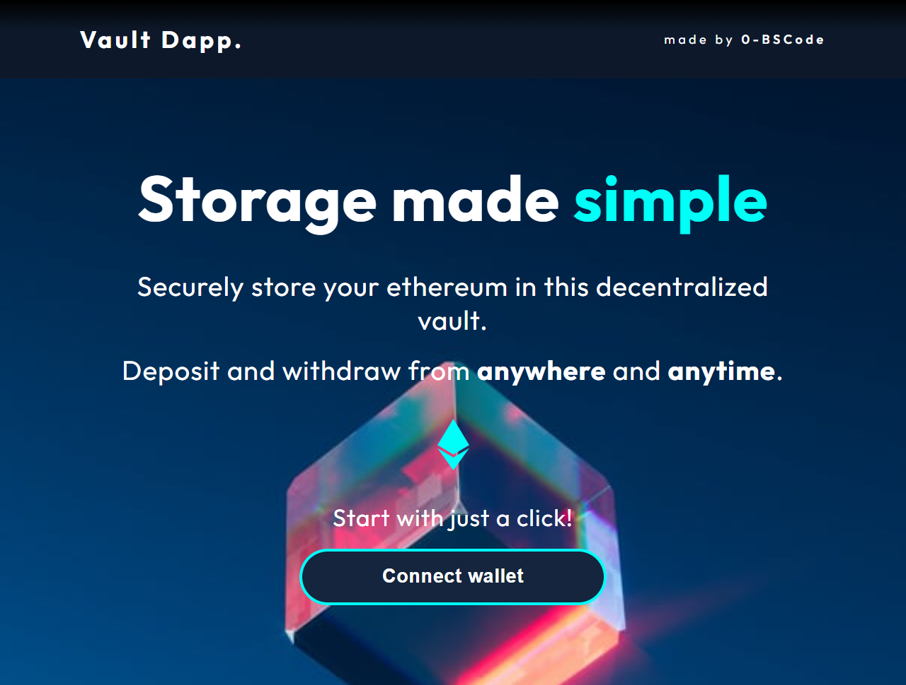

# Vault Dapp
A simple storage decentralized application where you can store and/or withdraw ethereum.

## Screenshot

## How to Run
1. Clone the repository.
2. Install Truffle via `npm i -g truffle`.
3. Activate truffle's local test chain via `truffle develop`.
4. Deploy the contracts to the local test chain via `truffle migrate`.
5. Navigate to the `client` directory and run `npm start`.
   - Make sure Metamask is installed.
6. Connect Metamask to the local test chain.
   - Click `Add Network`
   - Add *http://localhost:7545* to `New RPC URL` field.
   - Place *1337* in the `ID` field.
   - Place *ETH* in the `Currency Symbol` field.

#### Upcoming Features
1. Transfer between accounts
2. Log events and update UI based on them
3. Update input field to reflect erroneous values
4. Have balance display account for many decimal points
5. Allow for deposit/withdrawal in Wei
6. Deploy contract and frontend